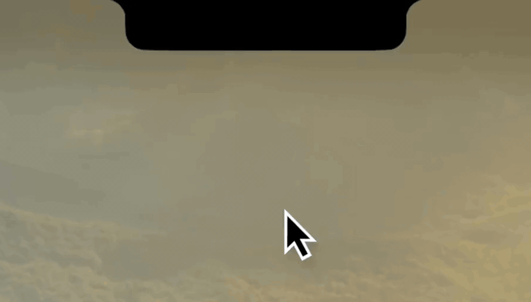
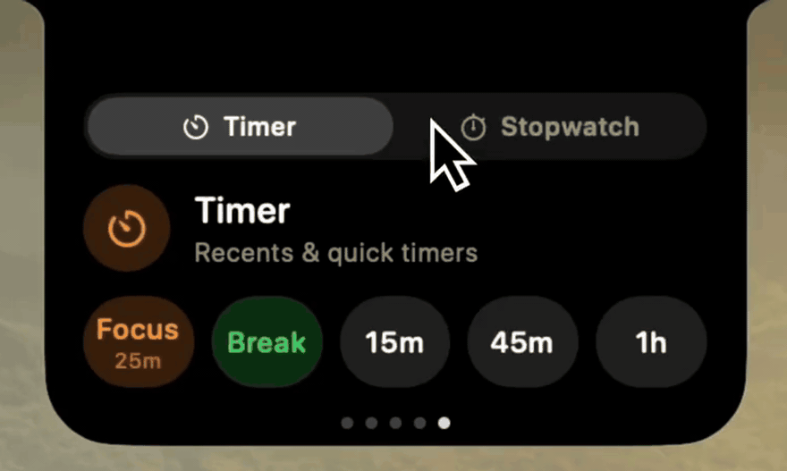
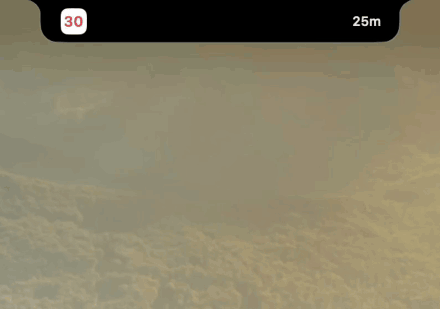

<div align="center">

# Ledge

**Your MacBook's notch, put to work.**

You already look up there. Ledge puts what you're checking anyway — the song,
the timer, the next meeting — in the black bar you've been ignoring since 2021.
Quiet when nothing is happening, there the moment something is.

<a href="https://github.com/egemertbalcik/Ledge/releases/latest/download/Ledge.dmg"></a>
<a href="https://buymeacoffee.com/egebalcik" target="_blank" rel="noopener noreferrer"></a>

[ledgeapp.dev](https://ledgeapp.dev) · free · open source · no account, no telemetry


</div>

---

## Skip a track without losing your place

Cover art, the title, the scrub bar, the buttons. Send the sound to your AirPods
from the same card. Works with Music, with Spotify, and with whatever tab is
playing in your browser.



## Keep an eye on the timer without watching it

Start a focus session and the countdown moves to the edge of the notch. It sits
there while you work, close enough to glance at, too small to distract you.



## Your day, one glance up

What's next, and the month it belongs to. The weather where you are, and the
hours coming.

<table>
<tr>
<td width="50%"></td>
<td width="50%"></td>
</tr>
</table>

## And the rest

| | |
|---|---|
| **Volume & brightness** | A readout that replaces the grey square macOS drops in the middle of your screen. Hover it and the bar becomes a slider. |
| **AirPods & Bluetooth** | They connect, you see it — with battery, and the case animation you were promised on the iPhone. |
| **Battery** | Where it stands, and a nudge while there's still time to do something about it. |
| **Focus modes** | Tells you which mode just turned on. macOS barely mentions it. |
| **File shelf** | Drop files on the notch, pull them out later. New screenshots land there by themselves. |
| **Camera & mic** | A dot when something is recording, right where you're looking. |
| **Caps Lock & keyboard layout** | Which one is on, without hunting for a menu bar flag. |
| **Levels** | Sound and brightness as sliders on a card, for the keyboards and mice with no keys for it. |

Every one of these can be switched off on its own. A source you turn off is
never even built, so it does no work and asks for nothing.

## What it will never do

Ledge **records nothing**. No screen capture, no audio capture, no capture
permission, no recording indicator lighting up in your menu bar — ever. The
equalizer that dances along with your music never hears a note of it: it's an
animation seeded from the track, reading zero bytes of audio. There was an early
version that sampled system audio, and it was deleted for exactly this reason.
Nobody should have to trust a notch app with a microphone.

It also stays **out of your screenshots**, your recordings and the screen you
share in meetings. There's a switch for when you do want to show it off.

Four things go over the network and nothing else: the weather (Open-Meteo, with
your coordinates rounded to about a kilometre), the place name for it (Apple),
cover art from whatever is playing, and the update check. No account, nothing to
sign up for, no telemetry.

## What it reaches for

Ledge does things macOS does not offer publicly, and you should know what before
you install it.

It is **not sandboxed**, and it uses two private frameworks: `DisplayServices`
for brightness, and `MediaRemote` to see what is playing in any app. Reading
MediaRemote is not permitted to ordinary apps, so Ledge loads a small library of
its own into `/usr/bin/perl` — a program Apple signs and entitles — and asks
from there. That library does one thing, exports one symbol, and reports what is
playing; nothing is written, and nothing else is touched. Every private symbol
is looked up at runtime and checked, so when Apple removes one the feature
quietly stops instead of the app crashing.

Accessibility, if you grant it, is used for one purpose: catching the volume and
brightness keys so Ledge's readout can replace the system's rather than appear
under it.

The consequences are real: this is software that can break on any macOS update,
and it can never be sold on the App Store. The source for all of it is here.

## Install

[Download the DMG](https://github.com/egemertbalcik/Ledge/releases/latest/download/Ledge.dmg),
drag Ledge into Applications, and open it **from Finder** — macOS gives the
permissions to whatever launched the app, so starting it from a terminal hands
them to the terminal instead. After that it keeps itself up to date with
[Sparkle](https://sparkle-project.org); there's a *Check for Updates…* in
Settings, under About.

There's no Dock icon and no menu bar item — the notch is the app. Open Ledge
again from Finder or Spotlight and the copy that's already running brings its
Settings up. Quitting is a button in there, under General.

**You'll need** a MacBook with a notch — Pro from 2021, Air from 2022 — on macOS
26 or later. Ledge draws on that display and nowhere else, on purpose: external
monitors come in every shape, and a silhouette cut for the notch wouldn't be the
same app on them.

## Permissions

Nothing is asked for at launch. Each permission is requested by the one feature
that needs it, from the Permissions tab in Settings — and everything else carries
on without it.

| Permission | What it gives you | If you say no |
|---|---|---|
| Accessibility | Ledge's readout instead of the system one | You get both, stacked |
| Automation | Cover art and scrubbing in Music and Spotify | Music still shows up, just without the artwork |
| Calendars | Your next event, and the month | No calendar card |
| Bluetooth | Connections the moment they happen, and AirPods proximity | Still read, just a beat later |
| Focus status | The notch says when a Focus is on, and stays quiet during it | Announcements come through regardless |
| Full Disk Access *(optional, not asked for)* | The Focus card follows the switch immediately, and names the mode | Still shown, within a few seconds, as "Focus" |
| Location | Weather for wherever you are | Weather for a city you type in |

## Build it yourself

```sh
git clone https://github.com/egemertbalcik/Ledge.git
cd Ledge
make run          # build, sign, launch
```

You'll need Swift 6.2 and an `Apple Development` signing identity. `make test`
runs the suite, `make lint` checks the layer boundaries.

Written from scratch, with no code from any other project.

## License

Copyright © 2026 Ege Mert Balçık. GPL-3.0 — see [LICENSE](LICENSE). Fork it,
learn from it, ship your own — as long as what you ship stays open too.

---

<div align="center">

Made by <a href="https://github.com/egemertbalcik">Ege Mert Balçık</a> · <a href="https://ledgeapp.dev">ledgeapp.dev</a><br>
If Ledge earns its place in your notch, <a href="https://buymeacoffee.com/egebalcik" target="_blank" rel="noopener noreferrer">buy me a coffee</a>.

</div>
